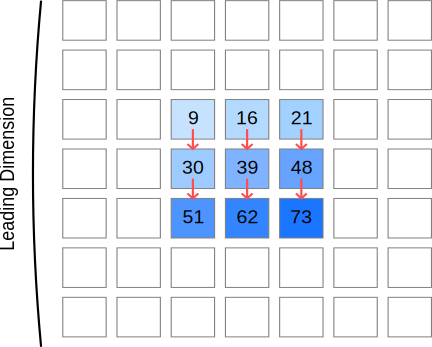

# 先導次元（Leading Dimension）の意味と重要性

## 先導次元とは何か

先導次元（Leading Dimension）とは、2次元配列におけるメモリレイアウトを指定するためのパラメータです。C/C++での行列計算において、特に高性能計算（HPC）ライブラリを使用する際に重要な概念です。このチュートリアルでは一貫して列優先（column major）方式を考えます。

簡単に言えば、**先導次元は行列の1列を表現するために確保されているメモリの実際のサイズ**を表します。

## 行優先と列優先：メモリレイアウトの基本

2次元配列をコンピュータのメモリ（1次元）上に格納する際、主に2つの方式があります。両方の方式を理解することが重要ですが、このチュートリアルでは列優先方式に焦点を当てています。

### 1. **列優先方式（Column-Major Order）**

列ごとに連続してメモリに格納する方式です。FORTRAN、MATLAB、Rなどの科学計算向け言語で採用されています。

```
メモリ上の配列：[1, 5, 9, 2, 6, 10, 3, 7, 11, 4, 8, 12]

2次元配列として解釈：
[1,  2,  3,  4]
[5,  6,  7,  8]
[9, 10, 11, 12]
```

### 2. **行優先方式（Row-Major Order）**

行ごとに連続してメモリに格納する方式です。C、C++、Python、Javaなどの多くのプログラミング言語で採用されています。

```
メモリ上の配列：[1, 2, 3, 4, 5, 6, 7, 8, 9, 10, 11, 12]

2次元配列として解釈：
[1,  2,  3,  4]
[5,  6,  7,  8]
[9, 10, 11, 12]
```

## 先導次元（Leading Dimension）の概念

行列演算において、特に大規模な行列の一部分（部分行列）だけを使用する場合に重要になるのが「先導次元（Leading Dimension, LD）」です。

例えば、次のような7×7の行列、三つの積を考えましょう：

```
   0  0  0  0  0  0  0      0  0  0  0  0  0  0       0  0  0  0  0  0  0
   0  0  0  0  0  0  0      0  0  0  0  0  0  0       0  0  0  0  0  0  0
   0  0  9 16 21  0  0      0  0  1  2  3  0  0       0  0  9  8  7  0  0
   0  0 30 39 48  0  0  =   0  0  4  5  6  0  0   *   0  0  6  5  4  0  0
   0  0 51 62 73  0  0      0  0  7  8  9  0  0       0  0  3  2  1  0  0
   0  0  0  0  0  0  0      0  0  0  0  0  0  0       0  0  0  0  0  0  0
   0  0  0  0  0  0  0      0  0  0  0  0  0  0       0  0  0  0  0  0  0
```

このような行列積は

```
   9 16 21       1  2  3       9  8  7
  30 39 48  =    4  5  6   *   6  5  4
  51 62 73       7  8  9       3  2  1
```

のように行うのが「筋が良い」はずです。この行列の中央部分（3×3の部分行列）のみを使って計算を行いたい場合、メモリ上では全体の行列が格納されているため、部分行列の要素にアクセスするには「どのように飛ばして次の行に移動するか」を指定する必要があります。

この「次の行に移動するためのステップ幅」を指定するのが先導次元です。

- 列優先方式では、先導次元は行列の全体の高さを表し、次の列の同じ行の要素にアクセスするためのステップ幅になります。

## 先導次元の役割

先導次元は、大きな行列の中から部分行列を取り出して計算する際に、メモリ上での正確な位置を計算するために使用されます。

例えば、上記の例では7×7の行列の中から3×3の部分行列を取り出して計算します。この時、各列の要素間の間隔は実際の行数（この場合は3）ではなく、元の行列の行数（この場合は7）となります。



列優先方式では、メモリ上で連続して存在するのは列方向の要素です。具体的には、9→30→51、16→39→62、21→48→73というように、各列は連続したメモリ領域に格納されています。列間のメモリオフセットは先導次元によって決まります。残念ながら、51→16, 62→21, 21→73は連続しません。ここの部分のメモリアクセスの連続性をなるべく確保するために、後述する「パッキング」という技術を使います。

行列計算ライブラリ（例：BLAS、LAPACK）では、関数呼び出し時に先導次元を指定する必要があります。

例えば、DGEMM（Double-precision GEneral Matrix Multiplication）関数の場合：

```c
void dgemm_(char *transa, char *transb, int *m, int *n, int *k,
           double *alpha, double *a, int *lda, double *b, int *ldb,
           double *beta, double *c, int *ldc);
```

ここで `lda`, `ldb`, `ldc` が各行列の先導次元を表します。これにより、実際に計算に使用する部分行列のサイズ（`m`, `n`, `k`）と、メモリ上での配置（`lda`, `ldb`, `ldc`）を別々に指定できます。

## 先導次元の実際の意味

上の例において、実際に計算に使用する行列は3×3ですが、メモリ上では7×7の行列の一部として存在しています。このとき：

- 計算に使う行列サイズ: 3×3
- メモリ上の行列サイズ: 7×7
- **先導次元(LD)**: 7

例えば、中央の3×3部分行列の左上要素（値1）は、7×7行列内では位置(2,2)にあります。なお、この例では0始まりのインデックスを使用しています。列優先のメモリレイアウトでは、この要素のメモリ位置は：
$2 + 2 \times \text{LD} = 2 + 2 \times 7 = 16$

さらに、次の列の同じ行の要素（値2）へアクセスするには：
$2 + 3 \times \text{LD} = 2 + 3 \times 7 = 23$

となります。

先導次元は次の2つの目的で使用されます。

1. **メモリアクセスの計算**: 列優先方式では、行列の任意の要素(i,j)にアクセスする際、そのメモリ位置は `i + j * LD` と計算されます。ここでi、jは0から始まるインデックスです。
2. **パディングの許可**: メモリアライメントのために行列の各列の末尾に余分なスペース（パディング）を追加できます。

## 実装例

例題の行列乗算を実装する場合、以下のようになります：

```c
// 悪い例: 先導次元が考慮されていない（部分行列の抽出ができない）
void matrix_multiply_bad(double* A, double* B, double* C, int n) {
    for (int i = 0; i < n; i++) {
        for (int j = 0; j < n; j++) {
            double sum = 0.0;
            for (int k = 0; k < n; k++) {
                sum += A[i + k * n] * B[k + j * n];  // 列優先方式のインデックス計算
            }
            C[i + j * n] = sum;
        }
    }
}

// 良い例: 先導次元を明示的に指定し、部分行列の乗算が可能
void matrix_multiply_good(double* A, double* B, double* C, 
                         int n, int lda, int ldb, int ldc) {
    for (int i = 0; i < n; i++) {
        for (int j = 0; j < n; j++) {
            double sum = 0.0;
            for (int k = 0; k < n; k++) {
                // 先導次元を使って直接メモリ位置を計算（列優先方式）
                sum += A[i + k * lda] * B[k + j * ldb];
            }
            C[i + j * ldc] = sum;
        }
    }
}
```

例題の場合、次のように呼び出せます：

```c
// 7x7行列内の3x3部分行列を乗算
int n = 3;      // 部分行列のサイズ
int ld = 7;     // 先導次元（7x7行列の高さ）

// 部分行列の左上要素の位置 (2,2) へのポインタを計算
// 0始まりのインデックスを使用
double* subA = &A[2 + 2 * ld];
double* subB = &B[2 + 2 * ld];
double* subC = &C[2 + 2 * ld];

// 関数呼び出し
matrix_multiply_good(subA, subB, subC, n, ld, ld, ld);
```

## DGEMMにおける先導次元の実装例

DGEMM関数を使って部分行列同士の積を計算する場合：

```c
// 大きな行列内の部分行列同士の乗算（DGEMM使用）
void multiply_submatrix_dgemm(double* A, double* B, double* C,
                             int m, int n, int k,     // 部分行列のサイズ
                             int lda, int ldb, int ldc) // 先導次元
{
    char transa = 'N';
    char transb = 'N';
    double alpha = 1.0;
    double beta = 0.0;
    
    // DGEMMを呼び出し
    dgemm_(&transa, &transb, &m, &n, &k, &alpha,
          A, &lda, B, &ldb, &beta, C, &ldc);
}
```

例題の場合、呼び出しは以下のようになります：

```c
// 7x7行列内の3x3部分行列を乗算
int m = 3, n = 3, k = 3;  // 部分行列のサイズ
int lda = 7, ldb = 7, ldc = 7;  // 先導次元

// 部分行列の左上要素の位置 (2,2) へのポインタを計算
// 0始まりのインデックスを使用していることに注意
double* subA = &A[2 + 2 * lda];
double* subB = &B[2 + 2 * lda];
double* subC = &C[2 + 2 * lda];

// 関数呼び出し
// DGEMMは先導次元を使って正確なメモリ位置を計算し、部分行列同士の積を効率的に求める
multiply_submatrix_dgemm(subA, subB, subC, m, n, k, lda, ldb, ldc);
```

## 最後に

先導次元の概念は、高性能な行列計算を実装する上で非常に重要です。特にDGEMMのような計算集約的な操作では、適切な先導次元の選択がパフォーマンスを大きく左右します。また、部分行列の計算を効率的に行うためにも、先導次元の正しい理解と使用が不可欠です。
