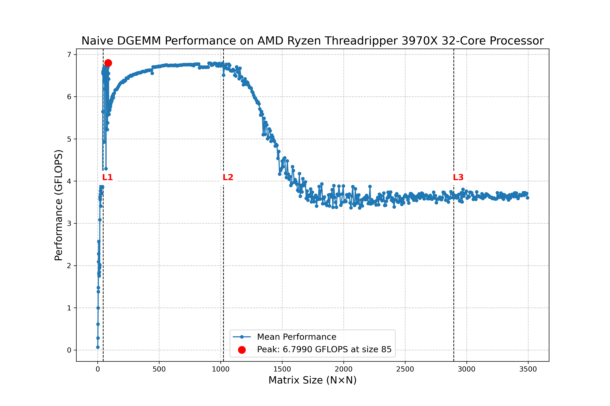

# 最も簡単なDGEMM実装 (NN版)

DGEMMのNN版は、行列の転置を行わない場合の実装です。この関数は以下の演算を行います:

```
C ← α×A×B + β×C
```

ここで:
- A は m×k の行列
- B は k×n の行列 
- C は m×n の行列
- α, β はスカラー値

## ソースコード
[https://github.com/nakatamaho/dgemm_tutorial/tree/main/06](https://github.com/nakatamaho/dgemm_tutorial/tree/main/06)

## 実装の説明

以下に、最も単純なDGEMM実装を示します。この実装では、行列AとBが転置されていない(NN: Not transposed)場合のみを考慮しています。


## 実装の解説

この実装は、行列積の最も基本的なアルゴリズムを使用しています。行列Cの各要素 C(i,j) は以下のように計算されます:

$$C(i,j) = \beta \times C(i,j) + \alpha \times \sum_{l=0}^{k-1} \left( A(i,l) \times B(l,j) \right)$$

ここで:
- $C(i,j)$ は結果行列の $(i,j)$ 要素
- $A(i,l)$ は第一入力行列の $(i,l)$ 要素
- $B(l,j)$ は第二入力行列の $(l,j)$ 要素
- $\alpha, \beta$ はスカラー係数
- 総和は $l=0$ から $k-1$ までの範囲

実装の流れは以下の通りです：

1. **特殊ケースの処理**：
   - 行列のサイズが0の場合や、計算結果が現在のCと同じになる場合は早期リターン
   - α=0の場合は行列積の計算をスキップし、βによるCの更新のみ行う

2. **主要計算部分**：
   - 列優先（column-major）メモリレイアウトを前提としたループ構造
   - 最外ループは列方向（j）
   - βによるCの初期化を各列ごとに行う
   - 行列積の計算はB(l,j)が0でない場合のみ行う最適化

3. **メモリアクセスの最適化**：
   - α×B(l,j)の値をtempに保存し再利用することで、内側ループでの乗算回数を削減
   - 列優先メモリレイアウトに合わせたアクセスパターンの採用

## ベンチマークをとる

以下のコードでvoid dgemm_simple_nnのベンチマークを取ります1から3500まで7ずつ正方行列として実行時間を測定します。
```cpp
#include <chrono>
#include <cmath>
#include <iostream>
#include <random>
#include <vector>
#include <algorithm>

#ifdef _OPENMP
#include <omp.h>
#endif

// 最も単純なDGEMM実装（NN版のみ）
void dgemm_simple_nn(int m, int n, int k, double alpha, const double *A, int lda,
                     const double *B, int ldb, double beta, double *C, int ldc) {
    // 簡単なケースの処理
    if (m == 0 || n == 0 || ((alpha == 0.0 || k == 0) && beta == 1.0)) {
        return;  // 何もしない
    }
    
    // alpha == 0の場合
    if (alpha == 0.0) {
        if (beta == 0.0) {
            // C = 0
            for (int j = 0; j < n; j++) {
                for (int i = 0; i < m; i++) {
                    C[i + j * ldc] = 0.0;
                }
            }
        } else {
            // C = beta * C
            for (int j = 0; j < n; j++) {
                for (int i = 0; i < m; i++) {
                    C[i + j * ldc] = beta * C[i + j * ldc];
                }
            }
        }
        return;
    }
    
    // メインの行列積計算: C = alpha * A * B + beta * C
    for (int j = 0; j < n; j++) {
        // betaによるCの初期化
        if (beta == 0.0) {
            for (int i = 0; i < m; i++) {
                C[i + j * ldc] = 0.0;
            }
        } else if (beta != 1.0) {
            for (int i = 0; i < m; i++) {
                C[i + j * ldc] = beta * C[i + j * ldc];
            }
        }
        
        // 行列積の計算
        for (int l = 0; l < k; l++) {
            if (B[l + j * ldb] != 0.0) {
                double temp = alpha * B[l + j * ldb];
                for (int i = 0; i < m; i++) {
                    C[i + j * ldc] += temp * A[i + l * lda];
                }
            }
        }
    }
}

// ランダム行列の生成
void generate_random_matrix(int rows, int cols, double *matrix) {
    unsigned int seed = static_cast<unsigned int>(std::chrono::system_clock::now().time_since_epoch().count());
    std::mt19937 mt(seed);
    std::uniform_real_distribution<double> dist(-1.0, 1.0);

    for (int j = 0; j < cols; ++j) {
        for (int i = 0; i < rows; ++i) {
            matrix[i + j * rows] = dist(mt);
        }
    }
}

// ベンチマーク関数
template <typename Func>
double benchmark(Func func) {
    auto start = std::chrono::high_resolution_clock::now();
    func();
    auto end = std::chrono::high_resolution_clock::now();
    std::chrono::duration<double> elapsed = end - start;
    return elapsed.count();
}

// 平均と分散の計算
std::pair<double, double> calculate_mean_and_variance(const std::vector<double> &values) {
    double mean = 0.0;
    double variance = 0.0;

    for (double value : values) {
        mean += value;
    }
    mean /= values.size();

    for (double value : values) {
        double diff = (value - mean);
        variance += diff * diff;
    }
    variance /= values.size();

    return {mean, variance};
}

int main() {
#ifdef _OPENMP
    std::cout << "OpenMP is enabled.\n";
    std::cout << "Number of threads (max): " << omp_get_max_threads() << "\n";
#else
    std::cout << "OpenMP is not enabled.\n";
#endif
    // 1から1000まで7ずつのサイズを生成（正方行列用）
    std::vector<int> sizes;
    for (int size = 1; size <= 1000; size += 7) {
        sizes.push_back(size);
    }
    
    const int num_trials = 5;
    std::mt19937 mt(std::random_device{}());
    std::uniform_real_distribution<double> dist(-1.0, 1.0);

    for (auto size : sizes) {
        // m = n = k = size の正方行列
        int m = size;
        int n = size;
        int k = size;
                double flop_count = static_cast<double>(m) * n * (2.0 * k + 1);

                std::vector<double> A(m * k);
                std::vector<double> B(k * n);
                std::vector<double> C(m * n);

                double alpha = dist(mt);
                double beta = dist(mt);

                generate_random_matrix(m, k, A.data());
                generate_random_matrix(k, n, B.data());
                generate_random_matrix(m, n, C.data());

                std::cout << "Benchmarking m=" << m << ", n=" << n << ", k=" << k << ":\n";

                // シンプル実装のベンチマーク
                std::vector<double> simple_flops_results;
                for (int trial = 0; trial < num_trials; ++trial) {
                    std::vector<double> C_test = C;
                    double elapsed = benchmark([&]() {
                        dgemm_simple_nn(m, n, k, alpha, A.data(), m, B.data(), k, beta, C_test.data(), m);
                    });
                    double flops = flop_count / elapsed / 1.0e9; // GFLOPS
                    simple_flops_results.push_back(flops);
                }

                auto [mean_simple_flops, var_simple_flops] = calculate_mean_and_variance(simple_flops_results);

                std::cout << "Simple Implementation:\n";
                std::cout << "  FLOPS for each trial [GFLOPS]: ";
                for (const auto &val : simple_flops_results) {
                    std::cout << val << " ";
                }
                std::cout << "\n";
                std::cout << "  Mean FLOPS: " << mean_simple_flops << " GFLOPS, Variance: " << var_simple_flops << "\n";
                std::cout << "------------------------------------------------\n";
            }
        }
    

    return 0;
}
```
## コンパイルと実行とプロット

```bash
# 最適化オプションを追加してバイナリ出力ディレクトリに生成
g++ -O2 -march=native 06_dgemm_naive.cpp -o 06_dgemm_naive

# ベンチマーク実行
./06_dgemm_naive
OpenMP is not enabled.
Benchmarking size 1...
Benchmarking size 2...
Benchmarking size 3...
Benchmarking size 4...
Benchmarking size 5...
Benchmarking size 6...
Benchmarking size 7...
Benchmarking size 8...
Benchmarking size 9...
Benchmarking size 10...
Benchmarking size 11...
Benchmarking size 12...
Benchmarking size 13...
...
Benchmarking size 3446...
Benchmarking size 3453...
Benchmarking size 3460...
Benchmarking size 3467...
Benchmarking size 3474...
Benchmarking size 3481...
Benchmarking size 3488...
Benchmarking size 3495...
Benchmark complete. Results saved to dgemm_benchmark_results.csv
```
dgemm_benchmark_results.csvというファイルができますので、プロットします。
```bash
# プロット生成
python3 plot.py
```

## 結果


    
## 結果の分析

プロットおよびベンチマーク結果から，行列サイズ $$N$$ に対する DGEMM 性能はキャッシュ階層ごとに大まかに分類できます。

新たに取得したプロットおよびベンチマーク結果から、行列サイズ $$N$$ に対する DGEMM 性能はキャッシュ階層ごとに以下の４つの領域に分かれることが確認できます。各領域の境界は、ワーキングセットサイズ  
$$2N^2 \times 8\ (\mathrm{Bytes})$$  
とキャッシュ容量との関係からも概ね整合しています。


1. **キャッシュサイズからの境界となる行列サイズの導出**

   - **L1 キャッシュ**：2048 KB
L1境界：
$$2N^2\times8 = 2{,}048 \mathrm{kB} \Rightarrow N\approx362$$  

   - **L2 キャッシュ**：16 MB
L2境界：
$$2N^2\times8 = 16 \mathrm{MB}\Rightarrow N=1024$$  

   - **L3 キャッシュ**：128 MB
L3境界：
$$2N^2\times8 = 128 \mathrm{MB}\Rightarrow N\approx2896$$  

2. **理論値に遠く及ばない性能**
   - binary64(倍精度)で[1.89 TFLOPS](https://github.com/nakatamaho/dgemm_tutorial/blob/main/02_flops.md)が理論性能値でした。
   - 実測の最大は約 6.799 GFLOPS にとどまり，理論値の0.36 % にすぎません。
   - 1コアでFMAを使い、SIMD（AVX2）を使わない場合の理論ピークは 7.4 GFLOPS と計算できます(1.8944  * 1000 / 32 (cores) / 16 (AVX2;SIMD) * 2 (FMA) = 7.4)。 
   - つまり、1コア、SIMDなしFMAありの場合の理論性能値では、92%も出ていました(Turboも入っているため正確ではない)。

3. **L1キャッシュ領域**  
   - 条件：
$$2N^2\times8 \le 2\,048\ \mathrm{kB}\quad (N \lesssim 362)$$  
   - 行列が完全にL1キャッシュ内に収まるため、FMAのみを使い、SIMDを使わないが、計算自体に滞りはない。  
   - 性能は行列サイズ増加とともにほぼ線形に上昇し、
$$N=85$$でピークの6.7990GFLOPSを記録。  
   - この領域における平均性能は  
$$5.38\ \mathrm{GFLOPS}\quad(\sigma=1.62\ \mathrm{GFLOPS})$$  
     と大きなばらつきを含む。

4. **L2キャッシュ領域**  
   - 条件：
$$2N^2\times8 \le 16\ \mathrm{MB}\quad (362 \lesssim N \le 1024)$$  
   - ワーキングセットがL2キャッシュに収まるため、キャッシュミスが抑えられ最も安定して高い性能レベルを維持。  
   - 平均性能は  
$$6.72\ \mathrm{GFLOPS}\quad(\sigma=0.056\ \mathrm{GFLOPS})$$  
     で、ピーク近傍の高い性能を継続。

5. **L3キャッシュ領域**  
   - 条件：
$$2N^2\times8 \le 128\ \mathrm{MB}\quad (1024 \lesssim N \le 2896)$$  
   - データがL3キャッシュ内にはあるもののL2を超えるため、ミス率上昇に伴い性能が漸減。
   -
$$N\approx1024$$付近では約6.77GFLOPSを維持するものの、  
$$N\approx2896$$付近では約3.37GFLOPSまで低下。  
   - 平均性能は  
$$4.22\ \mathrm{GFLOPS}\quad(\sigma=1.04\ \mathrm{GFLOPS})$$  
     と大きく変動する移行領域。

6. **メインメモリ領域**  
   - 条件：
$$N \gtrsim 2896$$  
   - ワーキングセットがL3を超え、DRAM帯域幅が性能制約となる。  
   - 平均性能は  
$$3.65\ \mathrm{GFLOPS}\quad(\sigma=0.056\ \mathrm{GFLOPS})$$  
     でほぼ横ばいになる。

## 注意点
1. gcc の-O3だと、FMAよりさらに最適化し、AVX2対応のための簡易的なブロッキングも行っていました。その結果は最大21.8864 GFLOPS (n=52)、平均は14.5531 GFLOPSでした。FMA,AVX2使用時の1coreの理論性能値は59.2GFLOPSなので、1コアの25%程度の性能を引き出すことができたことになりました。
