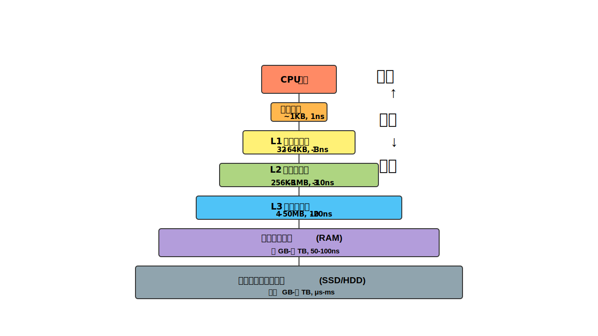

# CPU メモリ階層

行列乗算演算（DGEMM）のパフォーマンスを理解するためには、現代のCPUメモリ階層の構造を把握することが重要です。この知識は、キャッシュフレンドリーなアルゴリズムの設計に不可欠です。

## メモリ階層の概要

現代のコンピューターアーキテクチャは、次のような階層構造を持っています（速度が速い順）：

1. **CPU レジスタ**: 数ナノ秒のアクセス時間、数KB
2. **L1 キャッシュ**: 約1-3ナノ秒、数十KB（通常データ用とインストラクション用に分かれる）
3. **L2 キャッシュ**: 約3-10ナノ秒、数百KB〜数MB
4. **L3 キャッシュ**: 約10-20ナノ秒、数MB〜数十MB
5. **メインメモリ (RAM)**: 約50-100ナノ秒、数GB〜数TB
6. **ディスク (SSD/HDD)**: ミリ秒〜秒単位、数百GB〜数TB

この階層構造が存在する理由は、速度と容量のトレードオフにあります。速いメモリは高価で小容量、遅いメモリは安価で大容量です。



## 相対的なアクセス時間のスケール

CPUレジスタのアクセス時間を1秒と仮定した場合の各メモリ階層の相対的なアクセス時間は以下のようになります：

1. **CPU レジスタ**: 1秒（基準）
2. **L1 キャッシュ**: 1-3秒
3. **L2 キャッシュ**: 3-10秒
4. **L3 キャッシュ**: 10-20秒
5. **メインメモリ (RAM)**: 1分-1分40秒
6. **ディスク**:
   - **SSD**: 3時間 -1日
   - **HDD**: 11日-115日

この極端な違いが、なぜDGEMMのようなデータ集約型アルゴリズムでキャッシュ最適化が非常に重要なのかを示しています。

## メモリアクセスの影響

DGEMMのようなデータ集約型の計算では、メモリアクセスが主要なボトルネックとなります。これは「メモリウォール」と呼ばれる問題です。

$`メモリウォール = \frac{計算時間}{メモリアクセス時間} \ll 1`$

大規模な行列乗算では、すべてのデータをL1キャッシュに収めることができないため、キャッシュミスが発生します。

```math
$$ \text{演算量} = O(n^3)、\text{データ量} = O(n^2) $$
```

n×n行列の乗算では、演算量はO(n³)ですが、必要なデータ量はO(n²)です。つまり、各行列要素を複数回再利用できれば計算効率が向上します。

## キャッシュミスの影響

キャッシュミスの種類とDGEMMへの影響：

1. **コンパルソリーミス**: 初めてデータにアクセスする際に発生
2. **容量ミス**: キャッシュがデータセット全体を保持できない場合
3. **コンフリクトミス**: 異なるメモリ位置が同じキャッシュラインにマッピングされる場合
4. **TLBミス**: ページテーブル参照に失敗する場合

標準的な行列乗算の場合：

```math
$$ C_{ij} = \sum_{k=0}^{n-1} A_{ik} \times B_{kj} $$
```

この計算では、A行列は行方向に、B行列は列方向にアクセスされます。しかし、多くのプログラミング言語では配列は行優先で格納されるため、B行列へのアクセスはキャッシュ非効率的です。

