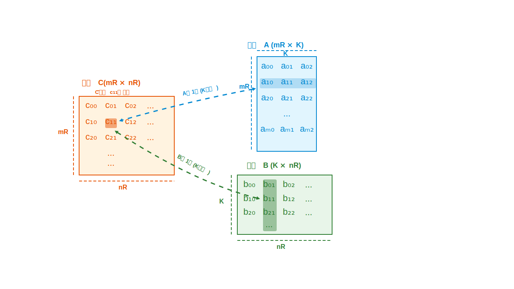

# ランク-1アップデートによるDGEMM最適化

## ナイーブ実装の問題点

行列乗算（DGEMM）の最も単純な実装では、ドット積を用いて結果行列 $`C`$ の各要素を計算します。この方法では、$`C`$ の各要素を計算するたびに主記憶から $`2K`$ 個の要素（行列 $`A`$ から $`K`$ 個、行列 $`B`$ から $`K`$ 個）を読み出す必要があります。マイクロカーネル（サイズ $`m_R \times n_R`$）全体では $`2K \cdot m_R \cdot n_R`$ 個のメモリロードが発生し、これはメモリ帯域幅のボトルネックとなります。

## レジスタ積み上げ方式（アウトプロダクト法）

この問題を解決するため、レジスタを効率的に活用するアウトプロダクト法（レジスタ積み上げ方式とも呼ばれる）を用います：

1. $`C`$ をゼロで初期化し、全体をレジスタに保持します（$`m_R`$, $`n_R`$ が小さいため可能）
2. $`k = 1, 2, \ldots, K`$ について繰り返し：
   - $`A`$ の1列と $`B`$ の1行をロード
   - それらの外積を計算し、結果を $`C`$ に累積

このアプローチの核心となるのが**ランク-1アップデート**（rank-1 update）と呼ばれる操作です。

## ランク-1アップデートの詳細

### 理論的背景

ランク-1行列とは、ベクトル $`x \in \mathbb{R}^{m_R}`$ と $`y \in \mathbb{R}^{n_R}`$ の外積 $`x y^T`$ で生成される行列であり、その行列のランクが1であることを意味します。

マイクロカーネルでは、各イテレーションで次のランク-1アップデート操作を行います：

```math
C \mathrel{+}= x y^T
```

これは、現在の $`C`$ の値にランク-1行列 $`x y^T`$ を加算する操作です。行列乗算全体を複数のランク-1アップデートの和として表現することで、メモリアクセスを大幅に削減できます。



### ランク-1アップデート方式の効率性

ランク-1アップデート方式では、メモリアクセスを大幅に削減できます。理由は、計算方法の根本的な違いにあります。

ナイーブな実装とランク-1アップデート方式を比較すると：

**ナイーブな実装（ドット積方式）**:
- 結果行列 $`C`$ の各要素（$`C_{ij}`$）を計算するとき、行列 $`A`$ の $`i`$ 行目全体（$`K`$ 個の要素）と行列 $`B`$ の $`j`$ 列目全体（$`K`$ 個の要素）を毎回メモリからロードします
- $`m_R \times n_R`$ の小行列ブロック全体では、$`2K \times m_R \times n_R`$ 回のメモリアクセスが必要

**ランク-1アップデート方式（外積方式）**:
- $`C`$ の小行列ブロック全体をレジスタに保持します
- 各イテレーションでは、$`A`$ から $`m_R`$ 個の要素（1列）と $`B`$ から $`n_R`$ 個の要素（1行）だけをロードします
- $`K`$ 回のイテレーションでは、メモリアクセスは合計 $`K \times (m_R + n_R)`$ 回だけ

つまり、通常のドット積計算では各要素計算ごとに大量のデータをロードし直すのに対し、ランク-1アップデート方式では少量のデータのロードで多くの計算を行い、結果をレジスタ上で蓄積していくため、メモリアクセス回数が大幅に削減されます。

$`m_R`$ と $`n_R`$ が大きいほど削減効果も大きくなり、多くの場合、計算速度はメモリ帯域幅によって制限されるため、このメモリアクセス削減は性能向上に直結します。

### ナイーブ実装とランク-1アップデートの比較例

同じ行列計算で両方の方式を比較してみましょう。

### 例題の設定

次の行列乗算 C = A × B を考えます：

```
A (4×3行列):     B (3×4行列):
[ 1  2  3 ]      [ 7  8  9 10 ]
[ 4  5  6 ]      [ 11 12 13 14 ]
[ 7  8  9 ]      [ 15 16 17 18 ]
[ 10 11 12 ]
```

マイクロカーネルサイズを m_R = 2, n_R = 2 として、左上のブロック（最初の2×2ブロック）を計算するプロセスを追跡します。

## ナイーブな実装（ドット積方式）

C[0,0]の計算:
1. Aの1行目をロード: [1, 2, 3] (3個の要素)
2. Bの1列目をロード: [7, 11, 15] (3個の要素)
3. ドット積を計算: 1×7 + 2×11 + 3×15 = 7 + 22 + 45 = 74

C[0,1]の計算:
1. Aの1行目をロード: [1, 2, 3] (3個の要素、再度ロード)
2. Bの2列目をロード: [8, 12, 16] (3個の要素)
3. ドット積を計算: 1×8 + 2×12 + 3×16 = 8 + 24 + 48 = 80

C[1,0]の計算:
1. Aの2行目をロード: [4, 5, 6] (3個の要素)
2. Bの1列目をロード: [7, 11, 15] (3個の要素、再度ロード)
3. ドット積を計算: 4×7 + 5×11 + 6×15 = 28 + 55 + 90 = 173

C[1,1]の計算:
1. Aの2行目をロード: [4, 5, 6] (3個の要素、再度ロード)
2. Bの2列目をロード: [8, 12, 16] (3個の要素、再度ロード)
3. ドット積を計算: 4×8 + 5×12 + 6×16 = 32 + 60 + 96 = 188

**合計メモリアクセス**: 3×2×2×2 = 24回（各要素2×2ブロックに対して、各行・列を3要素×2回ずつ読み込み）

## ランク-1アップデート方式（外積方式）

1. Cの2×2ブロックをレジスタに初期化:
   ```
   C_reg = [ 0 0 ]
           [ 0 0 ]
   ```

2. k=0のイテレーション:
   - Aから1列目をロード: [1, 4] (2要素)
   - Bから1行目をロード: [7, 8] (2要素)
   - ランク1アップデート:
     ```
     C_reg += [ 1 ] × [ 7 8 ] = [ 1×7  1×8 ] = [ 7  8 ]
              [ 4 ]             [ 4×7  4×8 ]   [ 28 32 ]
     ```

3. k=1のイテレーション:
   - Aから2列目をロード: [2, 5] (2要素)
   - Bから2行目をロード: [11, 12] (2要素)
   - ランク1アップデート:
     ```
     C_reg += [ 2 ] × [ 11 12 ] = [ 2×11  2×12 ] = [ 22  24 ]
              [ 5 ]               [ 5×11  5×12 ]   [ 55  60 ]
     ```

4. k=2のイテレーション:
   - Aから3列目をロード: [3, 6] (2要素)
   - Bから3行目をロード: [15, 16] (2要素)
   - ランク1アップデート:
     ```
     C_reg += [ 3 ] × [ 15 16 ] = [ 3×15  3×16 ] = [ 45  48 ]
              [ 6 ]               [ 6×15  6×16 ]   [ 90  96 ]
     ```

5. 最終結果:
   ```
   C_reg = [ 7+22+45   8+24+48 ] = [ 74  80 ]
           [ 28+55+90  32+60+96 ]   [ 173 188 ]
   ```

**合計メモリアクセス**: (2+2)×3 = 12回（各イテレーションでAから2要素、Bから2要素、計3イテレーション）

## 比較

- ナイーブ実装: 24回のメモリアクセス
- ランク-1方式: 12回のメモリアクセス（**50%削減**）

ランク-1方式では、一度ロードしたデータを最大限に活用して複数の計算を行うため、メモリアクセスが大幅に削減されます。行列のサイズが大きくなるほど、この削減効果はさらに顕著になります。


#### 要素数の比較

- **ランク-1アップデート**: 読み込む要素数 = $`(m_R + n_R)K`$ 個
- **ナイーブ実装**: 読み込む要素数 = $`2m_R \cdot n_R \cdot K`$ 個


#### 削減比率

削減の比率は次の式で表されます:

```math
\frac{2m_R \cdot n_R \cdot K}{(m_R+n_R)K} = \frac{2m_R \cdot n_R}{m_R+n_R}
```

#### 具体例

例えば、$`m_R = n_R = 4`$ の場合:

```math
\frac{2 \cdot 4 \cdot 4}{4 + 4} = \frac{32}{8} = 4
```

つまり、メモリアクセスが**1/4**に削減されます。

さらに、$`m_R = n_R = 8`$ の場合:

```math
\frac{2 \cdot 8 \cdot 8}{8 + 8} = \frac{128}{16} = 8
```

このケースでは、メモリアクセスが**1/8**にまで削減されます。

### スケーリング特性

$`m_R`$ と $`n_R`$ の値が大きくなるほど、この削減効果はさらに増大します。これは特に大規模な行列演算において顕著な効率改善をもたらします。理論的には、これらの値が大きければ大きいほど、メモリアクセスの削減効果は向上します。

しかし、実際の実装では、$`m_R`$ と $`n_R`$ の値は利用可能なレジスタメモリによって制約されます。レジスタは高速だが容量が限られているメモリであるため、無限に大きな値を設定することはできません。したがって、ハードウェアの制約の中で最適な値を選択する必要があります。

Ryzen3970Xには、AVX2をサポートしていて、YMM0-YMM15まで16本、256bitのレジスタがあります。これは、binary64は64bitなので、64個持つことができます。つまりCのブロックはぎりぎり8x8まで持てます。ただしぎりぎりだとあふれてしまう(レジスタスピル)こともあり、いろいろな値を試し多少余裕を持った値を使うのが良いと思われます。

### 実装例

以下は、レジスタ上での実装の疑似コード例です：

```
// レジスタにロード済みのベクトル A_reg[0..m_R-1], B_reg[0..n_R-1] を用いる
for i in 0..m_R-1:
    for j in 0..n_R-1:
        C_reg[i * ldc + j] += A_reg[i] * B_reg[j]
```

この実装では、`ldc`（leading dimension of C）を使用して行列Cのメモリレイアウトを正確に表現しています。この操作は、すべてのメモリアクセスをレジスタ内の読み書きに置き換え、メモリ帯域幅の制約を回避します。演算コストは $`m_R \times n_R`$ 回の乗算累加（multiply-accumulate）であり、FMA（Fused Multiply-Add）命令を用いることで1サイクルあたり最大2 FLOPを実現可能です。
