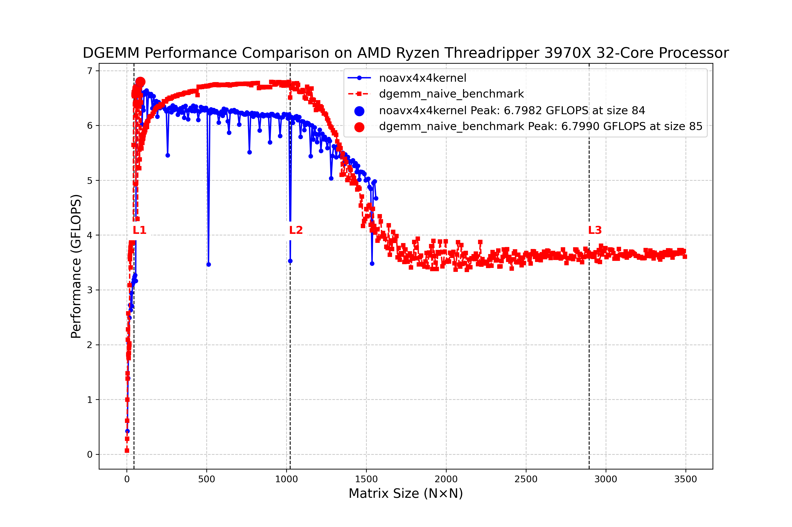

# AVX2(SIMD)を使わない4x4マイクロカーネルの実装

先ほどのパフォーマンスの理論的な解析から、まずはAVX2を使わないで4x4マイクロカーネルを実装して性能を評価してみましょう。AVX2を使うと不必要に複雑になりますので、いったんAVX2無しでカーネルを組みます。まずは、もっとも単純なブロック化を行い、L2キャッシュを生かすというのが今回のセクションの目的です。

## NoAVX 4x4マイクロカーネルの実装

今回実装したNoAVX 4x4マイクロカーネルは、AVX2などのSIMD命令を使わずにスカラー演算だけで実装された基本的なマイクロカーネルです。以下に実装の特徴を示します:

```cpp
// 4x4 マイクロカーネル (AVX2なし)
void noavx_micro_kernel_4x4(int k,
                            const double *A, int lda,
                            const double *B, int ldb,
                            double *C, int ldc,
                            double alpha, double beta)
{
    /* temporary registers that will finally hold
       beta*C + alpha*Σ_l a(il)*b(lj)                                  */
    double c00 = beta * C[0 + 0 * ldc];
    double c01 = beta * C[0 + 1 * ldc];
    double c02 = beta * C[0 + 2 * ldc];
    double c03 = beta * C[0 + 3 * ldc];

    double c10 = beta * C[1 + 0 * ldc];
    double c11 = beta * C[1 + 1 * ldc];
    double c12 = beta * C[1 + 2 * ldc];
    double c13 = beta * C[1 + 3 * ldc];

    double c20 = beta * C[2 + 0 * ldc];
    double c21 = beta * C[2 + 1 * ldc];
    double c22 = beta * C[2 + 2 * ldc];
    double c23 = beta * C[2 + 3 * ldc];

    double c30 = beta * C[3 + 0 * ldc];
    double c31 = beta * C[3 + 1 * ldc];
    double c32 = beta * C[3 + 2 * ldc];
    double c33 = beta * C[3 + 3 * ldc];

    for (int l = 0; l < k; ++l) {
        double a0 = A[0 + l * lda];
        double a1 = A[1 + l * lda];
        double a2 = A[2 + l * lda];
        double a3 = A[3 + l * lda];

        double b0 = B[l + 0 * ldb];
        double b1 = B[l + 1 * ldb];
        double b2 = B[l + 2 * ldb];
        double b3 = B[l + 3 * ldb];

        /* accumulate alpha*A*B directly */
        c00 += alpha * a0 * b0;   c01 += alpha * a0 * b1;
        c02 += alpha * a0 * b2;   c03 += alpha * a0 * b3;

        c10 += alpha * a1 * b0;   c11 += alpha * a1 * b1;
        c12 += alpha * a1 * b2;   c13 += alpha * a1 * b3;

        c20 += alpha * a2 * b0;   c21 += alpha * a2 * b1;
        c22 += alpha * a2 * b2;   c23 += alpha * a2 * b3;

        c30 += alpha * a3 * b0;   c31 += alpha * a3 * b1;
        c32 += alpha * a3 * b2;   c33 += alpha * a3 * b3;
    }

    /* store results */
    C[0 + 0 * ldc] = c00;   C[0 + 1 * ldc] = c01;
    C[0 + 2 * ldc] = c02;   C[0 + 3 * ldc] = c03;

    C[1 + 0 * ldc] = c10;   C[1 + 1 * ldc] = c11;
    C[1 + 2 * ldc] = c12;   C[1 + 3 * ldc] = c13;

    C[2 + 0 * ldc] = c20;   C[2 + 1 * ldc] = c21;
    C[2 + 2 * ldc] = c22;   C[2 + 3 * ldc] = c23;

    C[3 + 0 * ldc] = c30;   C[3 + 1 * ldc] = c31;
    C[3 + 2 * ldc] = c32;   C[3 + 3 * ldc] = c33;
}
```

### 最適化のポイント:rank1アップデートの実装

1. **rank1アップデートの採用**: 行列演算において、効率的にデータを使いまわします。
2. **レジスタの活用**: rank1 アップデートでは、結果のCはいったん読み込み、その後計算中は4x4の行列をそのままdoubleの変数として持つことにして、計算が終わったら書き戻すということを行います。そのようにして無駄なメモリ書き込みをせず、パフォーマンスを下げないようにします。
3. **L2キャッシュをフルに生かす**: L2キャッシュからのデータ供給速度が演算より高速になるようにします。その為に、4x4のブロッキングを行います。
4. **最適化**: 出力されたアセンブリとRyzen3970XのCPUの特性からこのカーネルを3FLOP/cycleで動かせます(4FMA+vmulsd)。理論性能値は3.7GHzで、11.1GFlops, 4.5GHzで、13.5GFLOPSです。10GFlopsなのでまずまずといったところでしょうか。

```cpp
c10 += alpha * a1 * b0;
c11 += alpha * a1 * b1;
```
という高レベルの一行に対しては、
vmulsd でまず α * a1 （スカラ乗算）を計算し
vfmadd231sd を2回呼んで
1回目で c10 += (α·a1) * b0
2回目で c11 += (α·a1) * b1
をそれぞれ FMA（Fused Multiply-Add）として実行しています。

問題点

1. **4の倍数のサイズの行列しか扱えない**: 端数処理はこの先でやります。
2. **L3キャッシュは生かせない実装**: A, Bの幅$`k`$が大きくなると、行列A, BはL2のキャッシュの外に出ます。すると、このrank1 アップデートの目論見ははずれ、パフォーマンスが落ちるはずです。次の章でその対策をします。

## 結果



## 分析

AVX2なし 4x4マイクロカーネル実装が単純なトリプルループ実装（ナイーブな実装）と比較してどの程度高速化されているかがわかります。

一般的な傾向として、以下のような特性が観察できます：

1. **そこそこ良いパフォーマンス**: 今回は、10.1GFlopsでました。このカーネルはFMAx2+vmulsdと展開されました。理論性能値は3FLOP/cycleとなります。3.7GHzだとFMAで11.1GFlops、4.5GHz(TurboBoost)では、13.5GFlopsです。
2. **小さなサイズ（L1キャッシュ内）**: マイクロカーネル実装は、ループのオーバーヘッドが減少するためナイーブな実装よりも多少高速化される傾向があります。

3. **中サイズ（L2キャッシュ内）**: マイクロカーネル実装の優位性は顕著になります。これは、rank 1アップデートによる行列-行列積がキャッシュ効率が向上するためです。ただ、そもそもAVX2を使わないため、そこまで効率は向上しません。

4. **大きなサイズ（L3キャッシュ以上）**: 行列A, Bのサイズが大きくなり、L2に入らなくなると性能は落ちます。これは当初の目論見通りです.

5. **ピーク性能**: 今回のマイクロカーネル実装はL2キャッシュに収まるサイズでピーク性能を発揮します。
   
## 次のステップへ

行列のサイズがL2に載らなくなってからの性能劣化をどう減らすかが課題です
1. L2キャッシュに載らなくなったあとの行列のメモリからCPUへの転送。これが一番重要です。n>=1024での性能劣化はこれが原因です。
2. マイクロカーネルの最適化。FMAはコンパイラが自動的に使ってくれますが、1コアの性能はAVX2を使わない限りもう上がりません。-O3である程度AVX2を使ってくれます。
