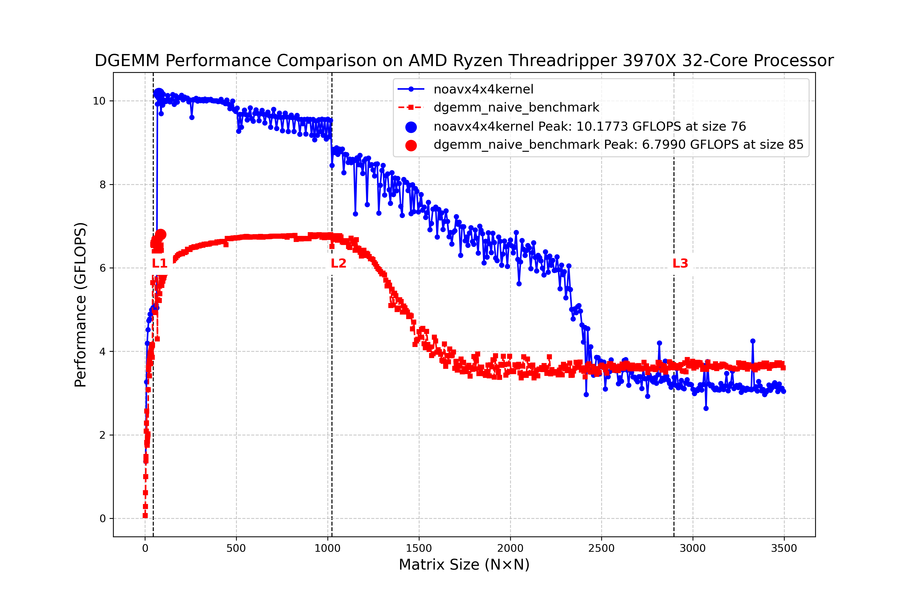

# AVX2(SIMD)を使わない4x4マイクロカーネルによるDGEMM高速化 

先ほどのパフォーマンスの理論的な解析から、まずはAVX2を使わないで4x4マイクロカーネルを実装して性能を評価してみましょう。まずは、もっとも単純なブロック化を行い、L2キャッシュを生かすというのが今回のセクションの目的です。

## NoAVX 4x4マイクロカーネルの実装

今回実装したNoAVX 4x4マイクロカーネルは、AVX2などのSIMD命令を使わずにスカラー演算だけで実装された基本的なマイクロカーネルです。以下に実装の特徴を示します：

```cpp
void noavx_micro_kernel_4x4(int k, const double *A, int lda,
                           const double *B, int ldb, double *C, int ldc) {
    // 一時変数に計算結果を蓄積
    double c00 = 0.0, c01 = 0.0, c02 = 0.0, c03 = 0.0;
    double c10 = 0.0, c11 = 0.0, c12 = 0.0, c13 = 0.0;
    double c20 = 0.0, c21 = 0.0, c22 = 0.0, c23 = 0.0;
    double c30 = 0.0, c31 = 0.0, c32 = 0.0, c33 = 0.0;
    
    // k方向に行列積を計算
    for (int l = 0; l < k; l++) {
        // Aの要素をロード
        double a0 = A[0 + l * lda];
        double a1 = A[1 + l * lda];
        double a2 = A[2 + l * lda];
        double a3 = A[3 + l * lda];
        
        // Bの要素をロード
        double b0 = B[l + 0 * ldb];
        double b1 = B[l + 1 * ldb];
        double b2 = B[l + 2 * ldb];
        double b3 = B[l + 3 * ldb];
        
        // 行列積の計算（16個の乗算と加算）
        c00 += a0 * b0; c01 += a0 * b1; c02 += a0 * b2; c03 += a0 * b3;
        c10 += a1 * b0; c11 += a1 * b1; c12 += a1 * b2; c13 += a1 * b3;
        c20 += a2 * b0; c21 += a2 * b1; c22 += a2 * b2; c23 += a2 * b3;
        c30 += a3 * b0; c31 += a3 * b1; c32 += a3 * b2; c33 += a3 * b3;
    }
    
    // 結果をCに格納
    C[0 + 0 * ldc] = c00; C[0 + 1 * ldc] = c01; C[0 + 2 * ldc] = c02; C[0 + 3 * ldc] = c03;
    C[1 + 0 * ldc] = c10; C[1 + 1 * ldc] = c11; C[1 + 2 * ldc] = c12; C[1 + 3 * ldc] = c13;
    C[2 + 0 * ldc] = c20; C[2 + 1 * ldc] = c21; C[2 + 2 * ldc] = c22; C[2 + 3 * ldc] = c23;
    C[3 + 0 * ldc] = c30; C[3 + 1 * ldc] = c31; C[3 + 2 * ldc] = c32; C[3 + 3 * ldc] = c33;
}
```

### 最適化のポイント：rank1アップデートの実装

1. **rank1アップデートの採用**: 行列演算において、効率的にデータを使いまわします。
2. **レジスタの活用**: rank1 アップデートでは、結果のCはいったん読み込み、その後計算中は4x4の行列をそのままdoubleの変数として持つことにして、計算が終わったら書き戻すということを行います。そのようにして無駄なメモリ書き込みをせず、パフォーマンスを下げないようにします。
3. **L2キャッシュをフルに生かす**: L2キャッシュからのデータ供給速度が演算より高速になるようにします。その為に、4x4のブロッキングを行います。その為、まず、Ablock, Bblockとしてキャッシュに載せるためにコピーします。

問題点

1. **4の倍数のサイズの行列しか扱えない**: 端数処理はこの先でやります。
2. **L3キャッシュは生かせない実装**: A, Bの幅$`k`$が大きくなると、行列A, BはL2のキャッシュの外に出ます。すると、このrank1 アップデートの目論見ははずれ、パフォーマンスが落ちるはずです。次の章でその対策をします。


## 結果



## 分析

AVX2なし 4x4マイクロカーネル実装が単純なトリプルループ実装（ナイーブな実装）と比較してどの程度高速化されているかがわかります。

一般的な傾向として、以下のような特性が観察できます：

1. **小さなサイズ（L1キャッシュ内）**: マイクロカーネル実装は、ループのオーバーヘッドが減少するためナイーブな実装よりも多少高速化される傾向があります。

2. **中サイズ（L2キャッシュ内）**: マイクロカーネル実装の優位性は顕著になります。これは、rank 1アップデートによる行列-行列積がキャッシュ効率が向上するためです。ただ、そもそもAVX2を使わないため、そこまで効率は向上しません。

3. **大きなサイズ（L3キャッシュ以上）**: 行列A, Bのサイズが大きくなり、L2に入らなくなると性能は落ちます。これは当初の目論見通りです.

4. **ピーク性能**: 今回のマイクロカーネル実装はL2キャッシュに収まるサイズでピーク性能を発揮します。
   


次のステップとしては、SIMD命令（AVX2、AVX-512など）を活用して、より高度なマイクロカーネルを実装することで、さらなる性能向上が期待できます。また、ブロッキング戦略の最適化やパネル化、マルチスレッド化なども検討すべき発展的な最適化技術です。
