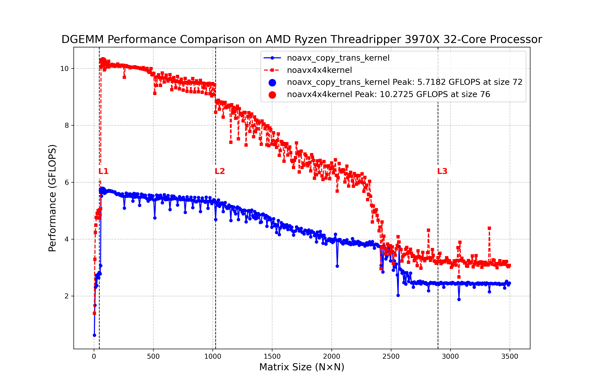

# パネル化:L2キャッシュからL3キャッシュへの拡張への布石

## はじめに

DGEMMの最適化において、CPUのキャッシュ階層を効率的に活用することが性能向上の鍵となります。前回のチュートリアルでは4×4のマイクロカーネルを実装し、L1/L2キャッシュに収まる小～中規模の行列では良好なパフォーマンスを達成しました。しかし、グラフからは、行列サイズがL2キャッシュの容量を超える（グラフの約1000付近）と、パフォーマンスが著しく低下していることがわかります。これには多段ブロックが有効です。ただいきなり多段ブロックを行うのはプログラムとしては難しくなります。したがって、マイクロカーネルの次の段階ブロック化として、パネル化技術の導入を行います。マイクロカーネルでは、アップデートされる部分のブロック化されたCはレジスタにありますが、A, B全体はL2に入っていることが前提です。次のブロック化としては、パネル化を行うことです。つまり、大きなA, Bを分割してL2に入れるということです。まず、ナイーブなパネル化を実装し、次にAのパネルの転置を行います。パネル化は実装上も利点があります。つまり転置やAB行列のα倍にも対応しやすくなります。残念ながらここで遅くなります。最適化しているはずなのに遅くなるのはフラストレーションが溜まりますが、少し我慢です。

## 現在の実装の限界

現在の実装では、行列を4×4の小さなブロックに分割して処理しています：

```cpp
#define MR 4
#define NR 4

// Process by blocks (MR x NR blocks)
for (int j = 0; j < n; j += NR) {
    for (int i = 0; i < m; i += MR) {
        // 小さなブロックをコピーして処理
        // ...
    }
}
```

この方法は、小さなブロックがL1/L2キャッシュに収まる場合には効果的ですが、大きな行列では以下の問題が発生します：

1. **頻繁なキャッシュミス**: 行列が大きいと、行列A、Bから繰り返しデータを読み込む際にL2キャッシュミスが頻発する
2. **メインメモリへの過剰なアクセス**: L3キャッシュが効果的に活用されず、メインメモリからの低速な読み込みが増加する
3. **データの局所性の低下**: 大きな行列では、時間的・空間的局所性が十分に活用されない

## パネル化技術の導入

L3キャッシュを効果的に活用するためには、より大きなブロックサイズを導入した多段階のブロック分割が必要です。ただ、いきなり多段のブロック化を行うのは大変で
大きな行列を効率的に処理するために、まず「パネル化」（Panelization）と呼ばれる技術を考慮します：

```cpp
#define CACHELINE 64
#if defined(__GNUC__) || defined(__clang__)
    #define ALIGN(x) __attribute__((aligned(x)))
#elif defined(_MSC_VER)
    #define ALIGN(x) __declspec(align(x))
#else
    #define ALIGN(x)
#endif

ALIGN(CACHELINE) static double Apanel[MC * KC];
ALIGN(CACHELINE) static double Bpanel[KC * NC];

// L3レベルのループ内で
// Aからパネルにコピー
for (int i = 0; i < ib; i++) {
    for (int p = 0; p < pb; p++) {
        Apanel[i + p * MC] = A[(i + i0) + (p + p0) * lda];
    }
}

// Bからパネルにコピー
for (int p = 0; p < pb; p++) {
    for (int j = 0; j < jb; j++) {
        Bpanel[p + j * KC] = B[(p + p0) + (j + j0) * ldb];
    }
}
```

パネル化により、L2キャッシュに収まるサイズのデータブロックを作成し、そのブロック内での計算を最適化できます。

# パネルの転置

## 転置によるメモリアクセスの最適化

ここからは行列の転置がDGEMM性能に与える影響について説明します。C/C++では配列は行優先（row-major）で格納されるため、行列乗算のような処理では、メモリアクセスパターンが非効率になる場合があります。

## 行列Aをそのまま使用する実装

最初の実装では、行列Aをそのままの形で使用しています：

```cpp
// Allocate temporary buffers
double Apanel[MC * KC];

// Copy A - MR rows x k columns block
for (int l = 0; l < k; l++) {
    for (int ii = 0; ii < MR; ii++) {
        Apanel[ii + l * MR] = A[(i + ii) + l * lda];
    }
}

// マイクロカーネルでのアクセス
double a0 = A[0 + l * lda];
double a1 = A[1 + l * lda];
double a2 = A[2 + l * lda];
double a3 = A[3 + l * lda];
```

この方法では、マイクロカーネル内で行列Aの要素にアクセスする際、`l`が変化すると大きなメモリアドレスの変化（ストライド）が生じます。このような非連続的なメモリアクセスはキャッシュミスを引き起こし、パフォーマンスを低下させる原因となります。

## 行列Aを転置して使用する実装

提供されたコードサンプルの2つ目の実装では、行列Aをコピーする際に転置を行っています：

```cpp
// Allocate temporary buffers - 転置するので KC×MC
double Apanel[KC * MC]; 

// Copy A while transposing - k rows x MR columns block (after transpose)
for (int ii = 0; ii < MR; ii++) {
    for (int l = 0; l < k; l++) {
        Apanel[l + ii * k] = A[(i + ii) + l * lda];
    }
}

// マイクロカーネルでのアクセス（転置済みのアクセスパターン）
double a0 = A[l + 0 * lda];
double a1 = A[l + 1 * lda];
double a2 = A[l + 2 * lda];
double a3 = A[l + 3 * lda];
```

この実装では、重要な変更点が2つあります：

1. **行列Aの格納方法**: `Apanel`のメモリレイアウトが`KC * MC`となり、データの物理的な配置が変わります。
2. **コピー時の転置**: 内側と外側のループが入れ替わり、データを転置しながらコピーします。

## 転置した場合の計算結果



## 転置による性能への影響

転置を行うことで以下のメリットがあります：

1. **カーネルの一元化**: 転置をカーネル外に追い出すことにより、プログラミングの手間が減ります。
2. **連続メモリアクセス**: マイクロカーネル内での計算時、lが変化しても連続したメモリ領域にアクセスできる
3. **キャッシュヒット率の向上**: 連続メモリアクセスによりキャッシュラインの利用効率が上がる
4. **プリフェッチの効率化**: 連続アクセスパターンはCPUのハードウェアプリフェッチャが効率的に機能する

一般に、行列サイズが大きくなるほど、転置によるメリットが顕著になります。

## 結論

行列乗算の最適化では、キャッシュ階層を考慮したブロック分割と、効率的なメモリアクセスパターンを実現するための転置が重要です。L3キャッシュへの最適化を進める際には、多段階のブロック分割を導入し、各レベルでのデータアクセスパターンを最適化することで、大規模な行列でも高いパフォーマンスを達成できます。ここでは、マイクロカーネルの一つ上のパネル化について実装しました。

実際の実装では、様々なブロックサイズや転置の有無をベンチマークしながら、最適な構成を見つけることが重要です。
