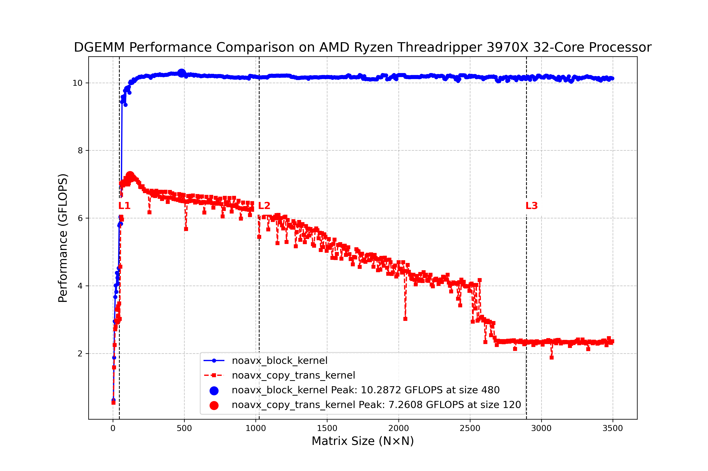

# DGEMM実装におけるブロック化技術

行列乗算（DGEMM）のような大規模な計算では、メモリアクセスがパフォーマンスの主要なボトルネックとなります。ブロック化とは、大きな行列を小さなブロックに分割して処理することで、キャッシュの局所性を高める手法です。

## ブロックサイズ

```cpp
#define MR 4    // マイクロカーネルの行サイズ
#define NR 4    // マイクロカーネルの列サイズ
#define MC 240  // Aパネルの行ブロックサイズ
#define NC 4096 // Bパネルの列ブロックサイズ
#define KC 256  // 共有次元のブロックサイズ
```

## 階層的ブロック化

典型的には3階層のブロック化を実装します:

1. **L3キャッシュレベルのブロック化**:NC, MC, KCサイズのブロックを使用
2. **レジスタブロック化**:MR, NRサイズのマイクロカーネル
3. **パネルパッキング**:連続的なメモリアクセスのためのデータ再配置

### ループ階層とキャッシュ階層の対応

* メインループ
| ループ | 変数 | ブロックサイズ | 想定キャッシュ層 | 主に再利用するパネル |
|-------|------|--------------|----------------|-------------------|
| L3    | `jc` | `NC (=4096)` | **L3/DRAM**    | `Bpanel` 全体     |
| L2    | `pc` | `KC (=256)`  | **L2/L3**      | `Bpanel` の KC 行  |
| L1    | `ic` | `MC (=240)`  | **L2**         | `Apanel` の 240 行 |

* マイクロカーネルのループ
| ループ | 変数 | ブロックサイズ | 想定キャッシュ層 | 主に再利用するパネル |
|-------|------|--------------|----------------|-------------------|
| μL2    | `jr` | `NR (=4)`    | **L1**         | `Bpanel` の 4 列   |
| μL1    | `ir` | `MR (=4)`    | **レジスタ**    | `C` の 4×4 ブロック |


## ブロック化手法

### パネルパッキング

```cpp
ALIGN(CACHELINE) static double Apanel[MC * KC];
ALIGN(CACHELINE) static double Bpanel[KC * NC];
```

これまで説明してきたように、元の行列データをキャッシュライン境界に合わせて再配置し、空間的局所性を向上させています。

### 3重ループの入れ子構造

```cpp
// NCブロックごとにNを処理
//L3
for (int j = 0; j < n; j += NC) {
    // KCブロックごとにKを処理
    //L2
    for (int p = 0; p < k; p += KC) {
        // パネルBのパッキング
        // MCブロックごとにMを処理
        //L1
        for (int i = 0; i < m; i += MC) {
            // パネルAのパッキング
            
            // マイクロカーネルでCブロックを計算
        }
    }
}
```

### キャッシュ最適化の要点
このループ構造は以下のメモリアクセスパターンを実現します：

* 空間的局所性の最大化：

各キャッシュレベルに適したサイズのブロックで処理
データのストライドアクセスを最小化


* 時間的局所性の最大化：

-最外層（L5）：Bパネル全体をL3キャッシュ/DRAMに配置
-中間層（L4）：BパネルのKC行をL2/L3キャッシュに配置
-中間層（L3）：AパネルのMC行をL2キャッシュに配置
-内側層（L2）：BパネルのNR列をL1キャッシュに配置
-最内層（L1）：Cの小さなブロック（MR×NR）をレジスタで処理


* パッキング効果：

-元の行列データを連続したメモリ領域に再配置
-キャッシュラインの効率的な利用を促進
-TLBミスを削減

### 4. マイクロカーネル最適化

```cpp
static inline void noavx_micro_kernel(...)
```

4x4のマイクロカーネルでは、レジスタ内でのデータ再利用を最大化し、命令レベル並列性を高めています。各反復でレジスタからのロード/ストア操作を最小限に抑えています。

## ブロック化の利点

1. **キャッシュ効率の向上**：データの再利用性を高め、キャッシュミスを減少
2. **TLBミスの低減**：小さなブロック単位で処理することでページフォールトを減少
3. **メモリバンド幅の効率的利用**：連続的なメモリアクセスパターンにより、プリフェッチ機能を活用
4. **並列処理の効率化**：ブロック単位で並列化しやすくなる（OpenMPにも対応）

## 結果


1. **メモリ転送の効率的な利用ができた**: データの使いまわし、データの流入のスケジュールが上手くいっています。L1, L2, L3に収まらない行列に対してもパフォーマンスが下がらないようになっています。パネル化によるコピーのオーバーヘッドも隠蔽できています。また、パネル化によって完全にメモリアクセスが連続になり、TLBミスが起こらず、キャッシュ効率がよいのも効いています。
2. **そこそこ良いパフォーマンス**: 今回は、10.3GFlopsでました。このカーネルはAVXを用いないため、FMAx2+vmulsdと展開され、このカーネルでの理論性能値は3FLOP/cycleとなります。3.7GHzだとFMAで11.1GFlops、4.5GHz(TurboBoost)では、13.5GFlopsです。
