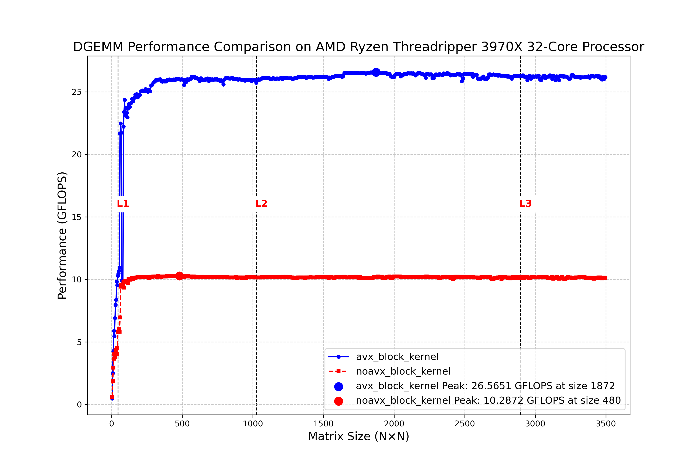

# 激闘！AVX2マイクロカーネル解説

**実況・山田＆解説・似鳥**
(同じ名前の別の方は二人ともプロ中のプロとして有名です。ただこの解説とは関係ありません。許可もとっておりません。問題がありましたらご連絡ください)

---
```cpp
void avx2_micro_kernel_4x4_aligned(int k,
                                   const double * __restrict A, int lda,
                                   const double * __restrict B, int ldb,
                                   double       * __restrict C, int ldc) {
    // 1) Load the existing C-block into accumulators
    __m256d c0 = _mm256_loadu_pd(&C[0 + 0*ldc]);
    __m256d c1 = _mm256_loadu_pd(&C[0 + 1*ldc]);
    __m256d c2 = _mm256_loadu_pd(&C[0 + 2*ldc]);
    __m256d c3 = _mm256_loadu_pd(&C[0 + 3*ldc]);

    // 2) Main loop over the shared dimension k
    for (int l = 0; l < k; ++l) {
        // Load one column of A (4 elements)
        __m256d a = _mm256_load_pd(&A[l * lda]);
        // Broadcast each of the 4 B-elements from row l
        __m256d b0 = _mm256_set1_pd(B[l * ldb + 0]);
        __m256d b1 = _mm256_set1_pd(B[l * ldb + 1]);
        __m256d b2 = _mm256_set1_pd(B[l * ldb + 2]);
        __m256d b3 = _mm256_set1_pd(B[l * ldb + 3]);
        // FMA accumulation
        c0 = _mm256_fmadd_pd(a, b0, c0);
        c1 = _mm256_fmadd_pd(a, b1, c1);
        c2 = _mm256_fmadd_pd(a, b2, c2);
        c3 = _mm256_fmadd_pd(a, b3, c3);
    }

    // 3) Store the updated accumulators back to C
    _mm256_storeu_pd(&C[0 + 0*ldc], c0);
    _mm256_storeu_pd(&C[0 + 1*ldc], c1);
    _mm256_storeu_pd(&C[0 + 2*ldc], c2);
    _mm256_storeu_pd(&C[0 + 3*ldc], c3);
}
```
**山田**: 皆さんこんばんは！お待たせしました！本日のメインイベント、AVX2マイクロカーネル4×4大決戦！私、実況の山田がお送りします！解説は似鳥さんです！

**似鳥**: ご覧いただきありがとうございます、似鳥です。今日は高速行列計算の最前線、AVX2マイクロカーネルの解説をさせていただきます！まさに計算機科学のリングの上で繰り広げられる熱い戦いですね！

**山田**: それでは早速、今夜のファイターをご紹介します！

```c
void avx2_micro_kernel_4x4_aligned(int k,
                                   const double * __restrict A, int lda,
                                   const double * __restrict B, int ldb,
                                   double       * __restrict C, int ldc) {
```

**山田**: 選手たちの入場です！A、B、Cの3選手、そして今回は`__restrict`という特別な装備を身につけていますね！これはどういう意味があるんでしょうか？

**似鳥**: これは非常に重要なテクニックですね、山田さん。`__restrict`は選手宣言の際の秘密兵器です。これをつけておくと「このポインタは他のポインタとメモリ領域が重ならない」とコンパイラに教えることができるんです。

**山田**: なるほど！それによってどんな効果が得られるんでしょう？

**似鳥**: コンパイラが最適化をさらに積極的に行えるんです。いわば「安全にもっと攻めて良いですよ」という選手へのサインですね。メモリの依存関係を心配せずに命令を並べ替えたりできるので、パフォーマンスが向上する可能性があります。これは上級者のテクニックですよ！

**山田**: プロの技ですね！それでは第1ラウンド、スタートです！

## 第1ラウンド：C値の読み込み - 戦いの基盤を築く！

```c
    // 1) Load the existing C-block into accumulators
    __m256d c0 = _mm256_loadu_pd(&C[0 + 0*ldc]);
    __m256d c1 = _mm256_loadu_pd(&C[0 + 1*ldc]);
    __m256d c2 = _mm256_loadu_pd(&C[0 + 2*ldc]);
    __m256d c3 = _mm256_loadu_pd(&C[0 + 3*ldc]);
```

**山田**: いきなり意外な展開です！C行列の値をロードしていますね！これはどういう意図があるんでしょうか？

**似鳥**: これは非常に重要な戦略です。このマイクロカーネルは単純な行列乗算ではなく、「C = C + A×B」という行列の更新操作を行っているんです。まず既存のC行列の値を読み込んでおいて、そこにA×Bの結果を加算していくアプローチですね。

**山田**: なるほど！ゼロから計算するのではなく、既存の結果に新しい計算結果を足し込むわけですね！

**似鳥**: そうなんです！これによって大きな行列を小さなブロックに分割して効率的に計算できるようになります。大規模な科学計算や機械学習で非常によく使われる手法なんですよ。ここでは4×4のブロックを扱っています。

## 第2ラウンド：メインループ - 熱い攻防！

```c
    // 2) Main loop over the shared dimension k
    for (int l = 0; l < k; ++l) {
```

**山田**: いよいよメインループの開始です！選手たちがリングに上がりました！

```c
        // Load one column of A (4 elements)
        __m256d a = _mm256_load_pd(&A[l * lda]);
```

**似鳥**: ここでA選手が4人同時に登場！AVX2の256ビットレジスタを使って一気に4つのdouble値をロードしています。これぞSIMD技術の真骨頂ですね！
例えば、
```math
C^{(1)}  = \begin{bmatrix}
C_{11}^{(1)} & C_{12}^{(1)} & C_{13}^{(1)} & C_{14}^{(1)} \\
C_{21}^{(1)} & C_{22}^{(1)} & C_{23}^{(1)} & C_{24}^{(1)} \\
C_{31}^{(1)} & C_{32}^{(1)} & C_{33}^{(1)} & C_{34}^{(1)} \\
C_{41}^{(1)} & C_{42}^{(1)} & C_{43}^{(1)} & C_{44}^{(1)}
\end{bmatrix}
=
\begin{bmatrix}
a_{11}\\
a_{21}\\
a_{31}\\
a_{41}
\end{bmatrix}
\begin{bmatrix}
b_{11} & b_{12} & b_{13} & b_{14}
\end{bmatrix}
```
というrank-1 updateについて、column majorな$`a_{11}`$, $`a_{21}`$, $`a_{31}`$, $`a_{41}`$を一気に読み込むわけですね!

**山田**: 一方のB選手はどうでしょうか？

```c
        // Broadcast each of the 4 B-elements from row l
        __m256d b0 = _mm256_set1_pd(B[l * ldb + 0]);
        __m256d b1 = _mm256_set1_pd(B[l * ldb + 1]);
        __m256d b2 = _mm256_set1_pd(B[l * ldb + 2]);
        __m256d b3 = _mm256_set1_pd(B[l * ldb + 3]);
```

**山田**: B選手、一列に並んでいます！しかも「分身の術」を使っているようですね！

**似鳥**: 鋭い観察眼です！ここでB選手は「ブロードキャスト」という技を使っています。1つの値を4つに複製する技ですね。Bの各要素を4回ずつ使いまわせるようにしているんです。

もう少しいうと、

```math
\begin{bmatrix}
b_{11} & b_{12} & b_{13} & b_{14}
\end{bmatrix}
```

は、1回目のrank-1updateで、$`b_{11}`$を以下のように使い回すわけです。

```math
\begin{bmatrix}
a_{11}\,b_{11} \\[6pt]
a_{21}\,b_{11} \\[6pt]
a_{31}\,b_{11} \\[6pt]
a_{41}\,b_{11}
\end{bmatrix}
```

そのため分身の術が出てくるんですよね〜素晴らしい技です

**山田**: ところで似鳥さん、素朴な疑問なんですが、なぜB行列の方を転置しているんでしょう？A行列を転置した方がいいように思えるんですが...普通$`\sum_k A(i,k)*B(k,j)`$で、column majorならk方向でメモリアクセスが連続になるということです。

**似鳥**: 素晴らしい質問です！これはrank-1更新という戦略の妙なんです。普通の積と違い、反転するんですよ。つまりこのアルゴリズムでは、A行列の一列（ここでは4要素）を一度に読み込んで、それを何度も使いまわします。一方、B行列は毎回異なる位置の値が必要になるんです。

**山田**: なるほど！

**似鳥**: そのため、アクセス頻度が高いB行列からのメモリ読み取りを連続的にするために、敢えてBを転置しているんです。メモリからのデータ読み込みは計算そのものよりも時間がかかることが多いですから、この工夫は非常に効果的なんですよ。我々の研究室ではこのアプローチをさんざん研究してきました。行列計算の神髄はメモリアクセスの最適化にあるんです！

**山田**: プロの戦略ですね！そして次はいよいよ攻撃の時間です！

```c
        // FMA accumulation
        c0 = _mm256_fmadd_pd(a, b0, c0);
        c1 = _mm256_fmadd_pd(a, b1, c1);
        c2 = _mm256_fmadd_pd(a, b2, c2);
        c3 = _mm256_fmadd_pd(a, b3, c3);
```

**似鳥**: ここで登場したのは最強の合体技「FMA」！Fused Multiply-Add、つまり「掛け算と足し算を一度に行う」技です！通常なら「掛け算」と「足し算」で2回の命令が必要ですが、FMAなら一発！これぞCPUの隠し技ですね！

**山田**: すごい効率です！そしてこの技を4回連続で放っていますね！

**似鳥**: そうなんです！この「c0 = a × b0 + c0」という操作こそがrank-1更新の核心なんです。これを「k」回繰り返すことで、行列乗算が完成します。毎回4×4=16個の浮動小数点演算を一気に実行しているんですよ！これがAVX2の真の力です！

## ファイナルラウンド：結果の格納 - 決着の時！

```c
    // 3) Store the updated accumulators back to C
    _mm256_storeu_pd(&C[0 + 0*ldc], c0);
    _mm256_storeu_pd(&C[0 + 1*ldc], c1);
    _mm256_storeu_pd(&C[0 + 2*ldc], c2);
    _mm256_storeu_pd(&C[0 + 3*ldc], c3);
}
```

**山田**: いよいよフィニッシュです！計算結果をメモリに格納しています！

**似鳥**: 最初にCから読み込んだ値に、計算結果を足し込んだものを、再びCに書き戻しています。これで「C = C + A×B」という計算が完了しました！見事なフィニッシュですね！

**山田**: このコードの優れている点はどこでしょうか？

**似鳥**: まず3つの点を挙げたいですね。1つは`__restrict`修飾子の使用によるコンパイラへのヒント。2つ目はメモリアクセスを最適化するためのB行列の転置戦略。そして3つ目はFMA命令の活用です。これらにより、CPU性能を最大限に引き出しています。

**山田**: そして、この4×4のブロック計算を組み合わせることで、より大きな行列計算も可能になるわけですね！

**似鳥**: その通りです！これはいわば「積み木」のようなもので、この小さなブロック計算を何度も呼び出すことで、巨大な行列計算も高速に処理できるようになります。こうしたマイクロカーネルは、科学計算や機械学習の基盤技術なんですよ。

**山田**: 素晴らしい解説をありがとうございました！今日のAVX2マイクロカーネル4×4大決戦、勝者はズバリ・・・効率的なプログラミングとメモリアクセス最適化です！

**似鳥**: 一見地味な最適化ですが、大規模データではその差が積み重なって大きなパフォーマンス差になるんです。こうした「細部へのこだわり」こそが、高性能コンピューティングの真髄と言えるでしょう。

**山田**: それでは、本日の「激闘！AVX2マイクロカーネル解説」はこれにて終了です！次回もお楽しみに！この後、スーパースロー映像で名場面を振り返ります！

**似鳥**: ありがとうございました！皆さんのコードも高速化されることを願っています！


## 結果



1. **そこそこ良いパフォーマンス**: 今回は、26.5GFlopsでました。理論性能値は59.2GFLOPS～72GFLOPSなので、少々パフォーマンスが出ていません。カーネルのパラメータのチューニングが必要なようです。

 
