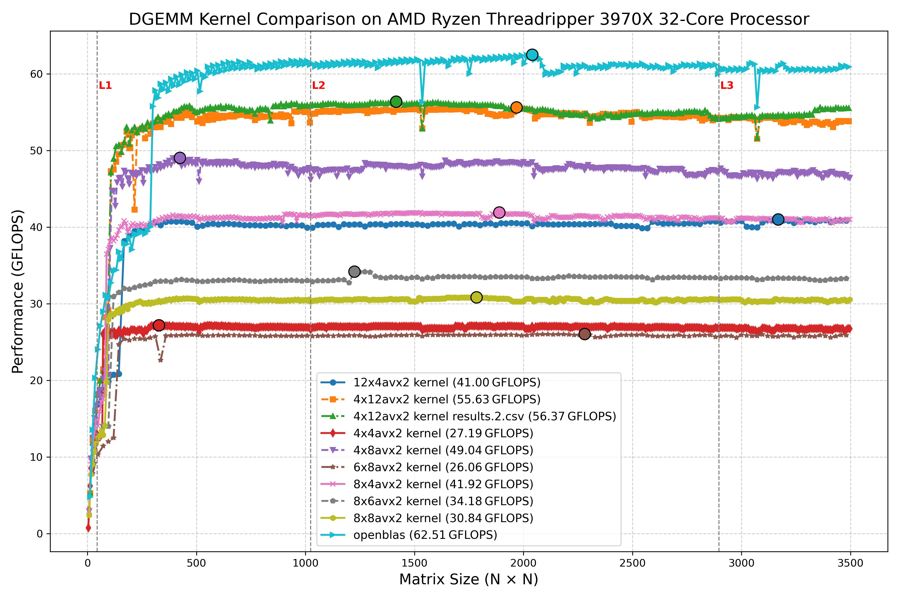

# DGEMM カーネルサイズ比較の詳細分析 - Ryzen Threadripper 3970X

## さまざまなサイズのAVX2カーネルでのベンチマーク

## ハードウェア特性との関連

AMD Ryzen Threadripper 3970Xの特性を考慮すると、パフォーマンス差が生じる理由が見えてきます：

1. **AVX2命令セットの特性**
   - Zen 2アーキテクチャのAVX2は256ビットSIMDをサポート
   - 倍精度浮動小数点（64ビット）では、1命令で4要素を同時処理可能
   - 「4x」で始まるカーネルが多く効率的なのはこのためです

2. **レジスタ構成との整合性**
   - Ryzenは16個の256ビットYMMレジスタを持つ
   - 4x12カーネルの場合：C行列用に12レジスタ、残りをA,B行列の要素に使用
   - 最高性能の4x12はレジスタ利用を最適化できている

3. **キャッシュとメモリアクセスパターン**
   - Ryzenのキャッシュライン：64バイト（倍精度8要素分）
   - 4x12カーネル：B行列を連続アクセス、A行列を再利用
   - メモリレイアウト（行優先）との相性が非常に良い

## 各カーネルサイズの詳細分析

- **4x12avx2（最高性能、約55 GFLOPS）**：
  - レジスタ、キャッシュ、メモリアクセスの完璧なバランス
  - B行列の連続アクセスが効率的で、キャッシュラインを最大活用
  - データの再利用パターンがThreadripperのキャッシュ階層と理想的にマッチ

- **4x8avx2（2番目、約48 GFLOPS）**：
  - やはり連続アクセスのメリットを享受
  - 列数が少ないため、4x12よりわずかに効率低下

- **8x4avx2（中程度、約42 GFLOPS）**：
  - 8行を同時処理するためレジスタ圧力が上昇
  - B行列の要素再利用率が低下し、キャッシュミスが増加

- **4x4avx2（低性能、約27 GFLOPS）**：
  - ブロックサイズが小さすぎて命令オーバーヘッドの割合が増加
  - 計算量に対するループ管理コストの比率が高い

- **8x8avx2（低性能、約30 GFLOPS）**：
  - ブロックが大きすぎてL1キャッシュでのデータ局所性が低下
  - レジスタスピル（不足）が発生している可能性

## キャッシュ階層の影響

グラフに示されたL1、L2、L3マーカーは重要な変化点です：
- L1境界（約256×256）：プライマリキャッシュからデータが溢れ始める
- L2境界（約1024×1024）：中間キャッシュからのヒット率低下
- L3境界（約2800×2800）：大きな共有キャッシュからメモリへのトラフィック増加

性能差が維持されているのは、効率的なマイクロカーネル（特に4x12）が、キャッシュから溢れてもデータ局所性を提供しているためです。
