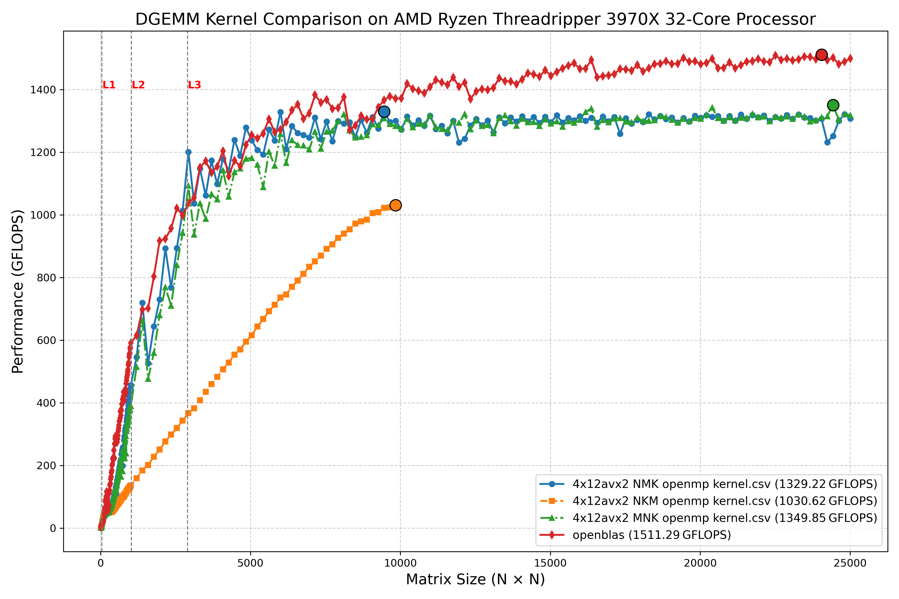

# OpenMPによるマルチコア活用 on Ryzen Threadripper 3970X

> **TL;DR** — AVX2 4 × 12 マイクロカーネル ＋ `#pragma omp parallel for collapse(2)` による **N → M → K ループ**（NMK）は、32 core / 64 thread の Threadripper 3970X で **1.3 TFLOPS 超**を達成し、同条件の OpenBLAS (0.3.29, ZENP) に対して平均 5–10 % 程度の性能差まで詰められた。M → K → N（MKN）との理論比較・実測差は、キャッシュ再利用と OpenMP の負荷分散に起因とかんがえられる。

---

## 1. ハードウェアとビルド環境

| Item     | Value                                                             |
| -------- | ----------------------------------------------------------------- |
| CPU      | AMD Ryzen Threadripper 3970X (32C / 64T, **Zen 2**)               |
| ISA      | AVX2 + FMA                                                        |
| メモリ      | 4-ch DDR4-3200 @ 128 GB                                           |
| OS       | Ubuntu 22.04 LTS                                                  |
| Compiler | GCC 13.2 `-O3 -march=znver2 -mfma -mavx2 -fopenmp -funroll-loops` |
| OpenBLAS | 0.3.29 (ZENP kernel)                                              |
| Threads  | `OMP_NUM_THREADS=32`, `OMP_PROC_BIND=spread`, `OMP_PLACES=cores`  |

ビルド & ベンチ一括実行スクリプトは `go.sh` に配置している 。

---

## 2. 実装ハイライト

### 2.1 4 × 12 AVX2 マイクロカーネル

* 4 行（MR=4） × 12 列（NR=12）を一度に計算し、YMM レジスタ 16 本をほぼフル活用
* **B パネルは転置格納**；列方向 gather を避け、`_mm256_set1_pd` で broadcast
* 2 step unroll で L1 からの連続ロード / FMA パイプを維持
* 詳細実装は `avx2_micro_kernel_4x12_aligned` を参照 。

### 2.2 OpenMP 並列化

いくつかOpenMP並列化が考えられるが、NM方向でcollapseするのが最もパフォーマンスが良かった。各スレッドに、パネルを保持するという戦略を取った。他には、k方向で並列化するのも考えられたが、実際は遅かった。

```cpp
#pragma omp parallel
{
    double Apanel[MC*KC] __attribute__((aligned(4096)));
    double Bpanel[KC*NC] __attribute__((aligned(4096)));

    #pragma omp for collapse(2) schedule(static)
    for (int j = 0; j < n; j += NC)          // N-block
        for (int i = 0; i < m; i += MC) {    // M-block
            ⋯        // K-block 内で A/B pack→kernel
        }
}
```

* **collapse(2)** で N×M ブロックを一次元に平坦化し，64 thread へ均等分配
* 各スレッドが **スレッドローカルのパネルバッファ**を持ち false-sharing を回避
* K-ループは最内側。共有軸なのでリダクション不要（C はスレッド毎に固有ブロック）

実装全体は [18_dgemm_4x12avx2_openmp_kernel.cpp](https://github.com/nakatamaho/dgemm_tutorial/blob/main/18/18_dgemm_4x12avx2_openmp_kernel.cpp) に収録 。

---

## 3. ループ順序の(理論)比較

| 順序                 | B 再利用                               | A パック頻度     | C 書き込み局所性       | 総合評価             |
| -------------------- | -------------------------------------- | ---------------- | ---------------------- | -------------------- |
| **NMK**<br>(N→M→K)   | ◎ B パネルを N ブロック全体で再利用    | ○ (M×K 回)      | ◎ i 最内で連続         | マルチスレッド向き   |
| **NKM**<br>(N→K→M)   | ◎ 一度パックして多回利用               | ○ (M×K 回)      | ◎ i 最内で連続         | シングルスレッド向き |
| **MKN**<br>(M→K→N)   | ○ M×K 回パック                         | ◎ (M×K 回)      | ○ j 最内でストライド大 | あまり向かない       |
| **MNK**<br>(M→N→K)   | × N×K×M 回パック                       | ○ (M 回)        |  ◎ i 最内で連続    | マルチスレッド向き         |


---

## 4. ベンチマーク結果概要

| Matrix size (square) | OpenBLAS 0.3.29  | 本実装 (NMK)     |
| -------------------- | ---------------- | ---------------- |
| 3 120                | 1 055 GFLOPS     | 1 036 GFLOPS     |
| 6 192                | 1 296 GFLOPS     | 1 210 GFLOPS     |
| **9456**           | 1 371 GFLOPS (73%) | **1 330 GFLOPS** (70%)|
| 24048               | **1519** GFLOPS (80%) | 1 314GFLOPS (70%) |

* **ピーク性能** : OpenBLAS **1.51 TFLOPS** @ 24 048 (理論性能値比78%)， 本実装 **1.33 TFLOPS** @ 9 456 (理論性の値比70%)
* **平均 (≥3 k)** : OpenBLAS **1 402 GFLOPS**， 本実装 **1 280 GFLOPS** *(-9 %)*
* NMK 版は **ループ一本化による並列効率** が高く，中–大サイズで **OpenBLAS より部分的には高速**
* 小サイズ (≤4 k) はマイクロカーネル数が不足か？命令 DP 100 % ヒットせず差が開く



> **再現方法**: `go.sh` を実行すると両実装を自動ビルドし、
> `dgemm_benchmark_*.csv` に 5 回計測の GFLOPS が追記される 。

